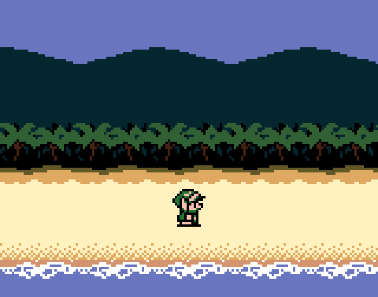

libtermboy
==========

**libtermboy** is a graphics library for the Linux console.  No, it's not an ASCII art library like [aalib](http://aa-project.sourceforge.net/aalib/) or [libcaca](http://caca.zoy.org/wiki/libcaca).  With libtermboy, you can draw pixel-perfect images in a text mode terminal.

To see the magic in action, clone the repository and execute `make run`.  Use ←/→ to move and press ESC to quit.

